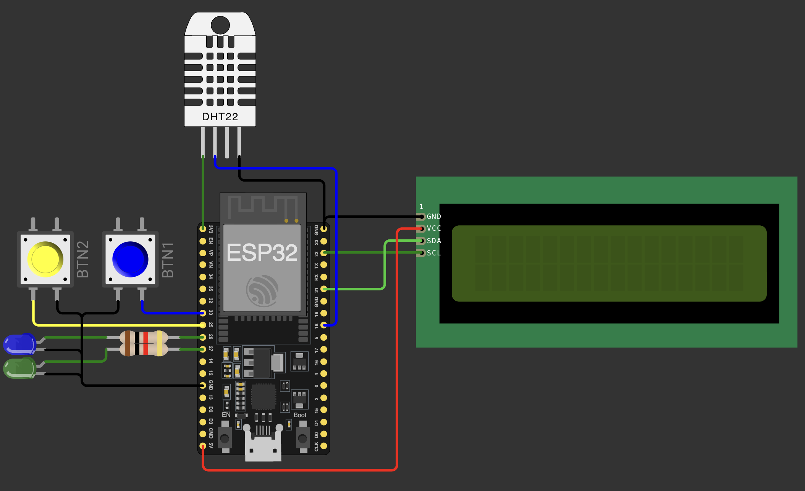

# Checkpoint 3 (CP3) — Disruptive Architectures: IoT

## INFORMAÇÕES DO ALUNO (Individual ou Dupla)

**Nome:** ____________________________________  
**RM:** ______________________________________  

**Nome:** ____________________________________  
**RM:** ______________________________________  

---

## Regras gerais

- **Prova individual.**
- Esta avaliação deve ser desenvolvida **no simulador Wokwi**.
- O código deve ser implementado em **Arduino/C++**.
- O exercício deve funcionar corretamente com os componentes solicitados.
- O uso de `delay()` **não é permitido** para controlar a lógica principal do sistema.
- O programa deve apresentar organização, clareza e coerência com o comportamento descrito no enunciado.

---
## Controlador IoT para Casa Inteligente

Você foi contratado para desenvolver o **controlador central de uma casa inteligente (Smart Home)**.

O sistema deverá permitir que o morador interaja com a casa de três formas:

1. **Fisicamente**, por meio de botões, LEDs, sensor DHT22 e display LCD.
2. **Remotamente**, por meio de uma API REST que retorna dados em JSON.
3. **Visualmente**, por meio de uma página HTML/CSS servida pelo próprio ESP32.


## Hardware utilizado

O circuito do projeto é o seguinte:



## Software 

O código deve ser desenvolvido seguindo a espepecificação abaixo, utilizando a plataforma Wokwi para simulação.

### Requisitos das interfaces do sistema

O sistema deverá disponibilizar três formas de interação.

#### 1 Interface física local

A interface física é composta pelos componentes conectados ao ESP32:

| Componente | Função |
|---|---|
| BTN1 | Consulta a Open-Meteo e atualiza os dados climáticos externos |
| BTN2 | Alterna o modo de exibição do LCD |
| LED1 | Representa um ponto de iluminação da casa |
| LED2 | Representa um segundo ponto de iluminação da casa |
| DHT22 | Mede temperatura e umidade internas |
| LCD | Exibe o painel físico local da casa inteligente |

#### 2 API REST

A API REST deverá ser composta por rotas iniciadas por `/api/`.

Todas as respostas da API REST deverão estar em formato JSON, inclusive respostas de erro.

#### 3 Interface Web

A rota raiz `/` deverá abrir uma página Web em HTML/CSS, servida diretamente pelo ESP32.

Essa página deverá funcionar como um painel visual simples da casa inteligente.

###  Comportamento dos botões físicos

#### BTN1 — Consulta climática externa

Ao pressionar o BTN1, o ESP32 deverá realizar uma requisição HTTP para a API Open-Meteo.

O sistema deverá armazenar os últimos dados externos obtidos, permitindo que eles sejam exibidos:

- no LCD;
- na página Web;
- no endpoint `/api/weather`;
- no endpoint `/api/status`.

#### BTN2 — Exibição do LCD

Ao pressionar o BTN2, o sistema deverá alternar entre diferentes telas do LCD. Sendo elas:

| Modo | Conteúdo exibido |
|---|---|
| 0 | IP do ESP32 e nome da rede |
| 1 | Temperatura e umidade internas do DHT22 |
| 2 | Estado dos LEDs do sistema |
| 3 | Dados externos da Open-Meteo |

### WebServer — Página HTML/CSS

A rota `/` deverá retornar uma página HTML com CSS contendo um painel visual da casa inteligente.

A página deverá exibir, no mínimo:

- título do projeto;
- IP do ESP32;
- temperatura e umidade internas;
- estado atual dos LEDs;
- última informação obtida da Open-Meteo.

A página poderá conter botões HTML para acionar endpoints da API REST, como:

- ligar/desligar LED1;
- ligar/desligar LED2;
- atualizar dados climáticos;


> A página não precisa ser complexa. O foco está em demonstrar que o ESP32 consegue servir uma interface Web funcional e integrada ao estado do sistema.

---

### API REST — Endpoints obrigatórios

Todos os endpoints abaixo devem estar funcionando e responder em JSON. usando a biblioteca `ArduinoJson` para parcer dados em JSON, tanto para leitura quanto para escrita.

| Endpoint | Método | Descrição |
|---|---|---|
| `/api/sensor/temphum` | GET | Retorna temperatura e umidade internas |
| `/api/led/1` | GET | Retorna o estado atual do LED 1 |
| `/api/led/1` | POST | Altera o estado do LED 1 |
| `/api/led/2` | GET | Retorna o estado atual do LED 2 |
| `/api/led/2` | POST | Altera o estado do LED 2 |
| `/api/weather` | GET | Consulta ou retorna dados climáticos da Open-Meteo |
| `/api/status` | GET | Retorna o status geral do sistema |


#### `GET /api/sensor/temphum`

Retorna a leitura atual do sensor DHT22.

Exemplo de resposta:

```json
{
  "source": "DHT22",
  "temperature": 25.3,
  "humidity": 62.1,
  "status": "ok"
}
```

#### `GET /api/weather`

Retorna os dados climáticos externos obtidos da Open-Meteo.

O endpoint pode consultar a Open-Meteo no momento da requisição ou retornar os últimos dados armazenados pelo sistema, desde que isso esteja implementado de forma coerente.

Exemplo de resposta:

```json
{
  "source": "Open-Meteo",
  "temperature": 28.4,
  "humidity": 65.0,
  "status": "ok"
}
```
#### `GET/POST /api/led/1` e `GET/POST /api/led/2`

Retornam o estado atual do LED correspondente.

Exemplo:

```json
{
  "led": 1,       // ou 2
  "state": "off", // ou "on"
  "status": "ok"
}
```

#### `GET /api/status`

Retorna um resumo geral do controlador da casa inteligente.

A resposta deve conter, no mínimo:

- IP do ESP32;
- estado dos LEDs;
- última leitura válida do DHT22;
- status dos dados climáticos externos.

Exemplo de resposta:

```json
{
  "ip": "192.168.0.100",
  "ssid": "MinhaRedeWiFi",
  "leds": {
    "led1": {
      "state": "on",
      "status": "ok"
    },
    "led2": {
      "state": "off",
      "status": "ok"
    }
  },
  "sensor": {
    "source": "DHT22",
    "temperature": 25.3,
    "humidity": 62.1,
    "status": "ok"
  },
  "weather": {
    "source": "Open-Meteo",
    "temperature": 28.4,
    "humidity": 65.0,
    "status": "ok"
  },
  "status": "ok"
}
```

### Display LCD

O display LCD representa o painel físico da casa inteligente e deve exibir informações relevantes do sistema, organizadas em telas alternadas e pelo BTN2 físico.

| Modo | Conteúdo exibido |
|---|---|
| 0 | IP do ESP32 e nome da rede |
| 1 | Temperatura e umidade internas do DHT22 |
| 2 | Estado dos LEDs do sistema |
| 3 | Dados externos da Open-Meteo |


### Tratamento de erros

Todas as rotas da API REST devem retornar respostas em JSON, inclusive em situações de erro. Exemplo:

```json
{
  "status": "error",
  "message": "Descrição do erro"
}
```

Para rotas inexistentes, recomenda-se retornar uma resposta semelhante a:

```json
{
  "status": "error",
  "message": "Rota não encontrada"
}
```


## Critérios de avaliação

A rubrica é acumulativa.

Para pontuar em um critério superior, espera-se que os critérios anteriores estejam funcionando de forma adequada.

### Critério 1 — Base física, API local e WebServer  
**Até 5,0 pontos**


| Item avaliado | Pontos |
|---|---:|
| Página `/` abrindo no navegador com HTML/CSS | 1,0 |
| `GET /api/sensor/temphum` retornando DHT22 em JSON, com tratamento de falha de leitura | 1,5 |
| `GET/POST /api/led/1` e `GET/POST /api/led/2` controlando LEDs, com validação de payload | 1,5 |
| LCD exibindo IP, temperatura e umidade | 1,0 |
---

### Critério 2 — Integração externa e status consolidado  
**Até 3,0 pontos**


| Item avaliado | Pontos |
|---|---:|
| BTN1 físico consultando Open-Meteo e atualizando os dados externos | 1,0 |
| `/api/weather` consultando ou retornando dados da Open-Meteo em JSON, com tratamento de falha | 1,0 |
| `/api/status` retornando dados completos e coerentes do sistema | 0,75 |
| Página Web exibindo dados atualizados do sistema | 0,25 |

---

### Critério 3 — Interface física, LCD e qualidade da solução  
**Até 2,0 pontos**


| Item avaliado | Pontos |
|---|---:|
| BTN2 físico alternando corretamente as telas do LCD | 0,75 |
| LCD exibindo telas alternadas coerentes: IP, sensores, LEDs e Open-Meteo | 0,5 |
| Organização, modularização e legibilidade do código | 0,5 |
| Commits e entrega correta no GitHub | 0,25 |
| **Subtotal** | **2,0** |
